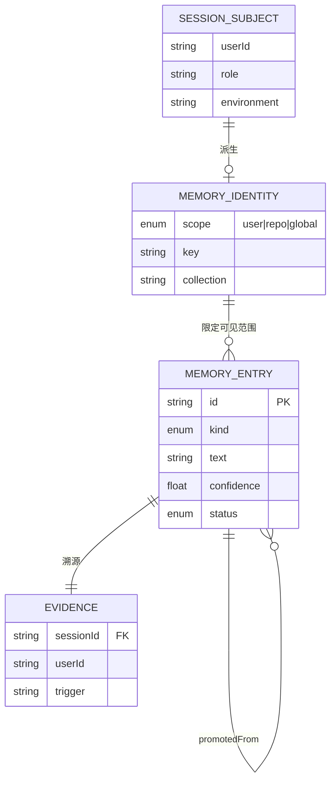

# P15-101 设计：用户维度的长期记忆隔离（借鉴 hermes-agent）

> 任务性质：核心是**设计**。**A 期（P15-101 ~ P15-103）已按本设计实现并单测覆盖**（现状核对见 §12）。
> 关联执行项：`DEV_SPEC.md` §15 —— P15-91 ~ P15-100 未开工；**P15-101 ~ P15-103 已完成（2026-09-23）**；待确认 10 / 11 / 12 **已全部拍板**（见 §10.1），B 期无悬置项。
> **跨仓库**：B 期的上游（RAG 侧三个记忆工具 + 分区隔离 + 三个坑的前置修复）设计已落 **`MODULAR-RAG-MCP-SERVER/DEV_SPEC.md` 阶段 J**（J0 ~ J13 + 任务 J-01 ~ J-14）。本文不复制那部分，只引用。
> 核对依据：本地源码实读（2026-09-23，两轮）—— `fiat-agent-pi/src/server/**`（含 A 期新增的 `identity/` 与 `memory/`）、`hermes-agent/agent/**` 与 `hermes-agent/plugins/memory/**`、`MODULAR-RAG-MCP-SERVER/src/**`（第三轮，为 B 期设计）。
>
> **v3 修订记录（2026-09-23 18:00）**：① §10.1 三条由「待拍板」转「已拍板」（tog：不留悬置项，RAG 项目一并设计）；② 新增「跨仓库契约」出口 —— 9 条接口契约固化在 `fiat-agent-pi/DEV_SPEC.md` **§15.16**，本侧**不再传 `collection`**（只传 `scope`+`key`）、`entry_id` 由本侧生成且**必须定长**；③ §12.4 改为「B 期进入条件（含 RAG 侧顺序）」；④ 新增三个坑的说明（RAG 侧实读所得）。
>
> **v2 修订记录（2026-09-23 17:30）**：① §2 借鉴条目由 3 条扩到 7 条（新增 2.4 哨兵默认值、2.5 读写过滤器不对称、2.6 非主上下文跳过写入、2.7 有界 drain 与熔断——均为 hermes 二读所得）；② 新增 §12「A 期实现现状核对」，闭合初稿 §7 那处悬空的 §12 引用；③ §1 现状按 A 期落地结果复核；④ §5.1 接口草案改为与实现逐字对齐；⑤ 威胁模型补 T10~T13。**初稿结论未变，以上均为增量。**

---

## 结论

**方向可行，但要先把两件事分开看。** §15 已经把「隔离的锁」设计完了——`MemoryScope`（§15.6）、collection 分区（§15.4）、scope/key 由 L2 注入（§15.7 + §15.14 规则 3）。**唯一缺的是「钥匙」：`userId` 从哪来、凭什么可信。** 照现状直接实现 §15，`user` scope 会退化成「所有人都是 `cli`」，隔离在纸面上成立、运行时失效。

> **✅ A 期状态（2026-09-23 追记）**：钥匙已插上 —— 其中判断 1 / 2 / 4 已闭环，判断 3（三层纵深）只闭环了前两层（第 ③ 道防线要等 B 期才有对象可校验）。逐条对照见 §12。下文 §1 是**改造前**的现状核对，保留作对照与推演依据 —— 不要把它当当前状态读。

四条判断：

1. **钥匙已经存在，只是没插上。** `SessionSubject.user.id`（`src/server/session/factory.ts:50-53`）已贯穿闸门②`permission-gate`（`:215-221`）、`audit-hook`（`:223-228`）、`fiatTools`（`:247-253`）、`evalRecorder`（`:271-278`）四个消费点。**记忆层是第五个、也是唯一漏接的**（`:323-333`）。本设计的主要工作量在「接线 + 立边界」，不在「造新机制」。

2. **该借鉴 hermes 的不是它的存储，是三条结构性做法**：身份由运行上下文**原样下发**、隔离键**只存在于组件内部**（不出现在任何对外 schema）、provider **失败降级不抛**。三条都能一比一映射到 fiat。

3. **隔离要做成三层纵深**（物理分区 / 闭包注入 / 后置校验）。只做「检索时过滤」是一个单点，RAG 侧一个 bug 就全线失守。**这是本文相对 §15 的主要增量。**

4. **落地分三期，第一期零新依赖。** 先让身份解析器 + 阶段 12 的 `workspace/memory/` 变成 per-user 目录，就能回答「同事能不能看到我的偏好」；RAG 那一套（要动跨仓库的 `MODULAR-RAG-MCP-SERVER`）放第二期。

---

## 1. 现状核对（全部实读，非凭记忆）

> ⚠️ **本章是「改造前」的快照**（2026-09-23 一读），保留作对照；每小节都附了 **A 期现状**，逐条对照见 §12。
> 关于定位：**fiat 源码的行号是当时快照** —— A 期改动已使部分行号漂移，定位请以「文件 + 符号名」为准；**`DEV_SPEC.md` 的引用一律用章节号**（初稿用行号，已验证会漂移，说明见 §1.4）。

### 1.1 身份模型：已有 `user.id`，但取值不可信（**A 期已修**）

`src/server/session/factory.ts` 的 `SessionSubject` 字段是齐的：

```ts
export interface SessionSubject {
	user: { id: string; role: string };
	environment: string;
}
```

问题在**取值来源**——改造前两处入口都是「读环境变量，缺省硬编码字符串」：

| 入口 | 改造前的值 | 缺省行为 | A 期现状 |
|---|---|---|---|
| 单会话 chat | `src/server/cli/index.ts` | `id: process.env.FIAT_USER_ID ?? "cli"` | `id: resolveIdentity().id`（多租户下解析失败即抛，由入口拒绝会话） |
| 常驻 CLI | `src/server/cli/entry.ts` 的 `cliSubject()` | `id: "cli"`（**恒为常量**） | 同上，经 `resolveIdentity()` |

`?? "cli"` 这一个写法就是全部问题的根：**它等价于 mem0 那个「不传 user_id 静默 fallback 到 `"default"`」的坑**——多租户下所有人的记忆并进同一个分区，且不报错。

> ⚠️ **A 期修完之后仍留一个尾巴**（解法见 §2.4）：`resolveIdentity()` 在**非多租户**模式下依旧返回 `{ id: "cli", source: "cli" }`。这是刻意的零行为变化，但意味着「未配置的本地部署」下所有调用方共用一个 `cli` 分区。它在**单人本地部署**下不是 bug（确实只有一个人），可是只要有人把 `FIAT_USER_ID` 显式设成 `cli`、或多人共用一台机器却不开 `FIAT_IDENTITY_SOURCE=os`，就会静默滑回混装，且**没有任何报错**。

顺带确认：`role` 是业务 RBAC 角色（`ops` / `oncall` / `viewer`，`config/tool_policies.yaml:8,26,32,44,90`），**不是审批角色**；审批白名单另设 `["oncall","ops"]`（`evolution/approval.ts:31`）。`role` 不能替代 `user.id` 做隔离——它是「一类人」，不是「一个人」。

其他身份出现处（供对照）：

| 位置 | 形态 | 用途 |
|---|---|---|
| `src/server/policy/engine.ts:27-30,85` | `FiatUser { id, role }` | 闸门③按 `req.user.role` 判权限 |
| `src/server/approval/ticket.ts:28-32` | `TicketSubject { userId, role, environment }` | 工单主体，落 `approval/store.sql` |
| `src/server/audit/schema.sql:9-10` | `user_id TEXT NOT NULL` | 审计表，**已有 `idx_audit_user (user_id, role)` 索引** |
| `src/server/gateway/runner.ts:104` | `userId = env.source` | 告警网关的「发起方」 |

→ **全仓没有 `tenant` / `account` / `operator` 概念。**

### 1.2 记忆层是唯一漏接身份的消费点（**A 期已接**）

改造前 `src/server/session/factory.ts` 的注入段：

```ts
const evolutionPrompt = opts.evolution
	? composeSystemPrompt("", {
			skills: opts.evolution.skillStore.index(),
			...(opts.evolution.memoryStore
				? { memory: opts.evolution.memoryStore.recentFacts(opts.evolution.memoryDays ?? 3) }
				: {}),
			...(opts.evolution.includeRoleFacts && opts.evolution.memoryStore
				? { roleFacts: opts.evolution.memoryStore.roleFacts(subject.user.role) }
				: {}),
		})
	: "";
```

两个调用**都没带 `subject.user.id`**：`recentFacts()` 无参数，`roleFacts()` 只吃 `role`。而同一函数上方，`gate` / `audit` / `fiatTools` / `evalRecorder` 全都显式传了 `subject.user`——**模式是现成的，只有记忆这一路漏了**。

**A 期现状**（`factory.ts`）：identity 在组合根**内部**派生后闭包进 reader，不从 `opts` 传入——

```ts
const memoryStore = opts.evolution?.memoryStore;
const memoryIdentity = memoryStore ? resolveMemoryIdentity(subject) : undefined;
// …
...(memoryStore && memoryIdentity
    ? { memory: memoryStore.recentFacts(memoryIdentity, opts.evolution.memoryDays ?? 3) }
    : {}),
```

> `identity` 不从 `opts` 传入是 §9-1「唯一构造点」的直接体现：让它从外部进来，等于多开一个可能构造错的口子。

拼接点仍在下游：`src/server/evolution/index-prompt.ts`（插 MEMORY_HEADER / ROLE_HEADER），最终由 `src/server/cli/chat.ts` 作为 `systemPrompt` 喂给 Pi。

### 1.3 阶段 12 记忆的物理布局：workspace 级共享（**A 期已改为 per-identity**）

改造前 `src/server/evolution/memoryStore.ts` 的两个落点：

```ts
private get memoryDir(): string { return join(this.workspace, "memory"); }
private factsDir(): string { return join(this.workspace, "facts", "roles"); }
```

- ② 事实 → `workspace/memory/YYYY-MM-DD.md`（按天）
- ③ 运行约定 → `workspace/facts/roles/<role>.md`（**按 role 聚合**）

`workspace` 根是**硬编码**的（`src/server/cli/entry.ts` 的 `WORKSPACE_DIR`），`config/settings.yaml` 里没有这一项。目录本身不在 git 里，运行时由 `appendAtomic` 的 `mkdirSync` 创建。

读取侧 `recentFacts(maxDays=3, maxChars=1200)` **全量注入近 3 天、零过滤**——**没有任何身份条件**。`roleFacts` 的文件头自己写着「**按 role 聚合，不是个人画像**」，这句话就是改造前的准确自述。

**A 期现状**：

```ts
private memoryDirFor(identity: MemoryIdentity): string {
    return join(this.workspace, "users", identity.safeKey, "memory");
}
```

- ② 事实 → `workspace/users/<safeKey>/memory/YYYY-MM-DD.md`，文件头写明 `scope=user · key=<原值>`（便于人肉核对分区）
- `recentFacts(identity, maxDays, maxChars)`：**入参只有 identity 与两个截断阈值**，没有可外部拼装的 scope/key
- ③ 运行约定 → **有意保持共享**（不是隔离失效，见 §3-L2 的 ⚠️ 框与 §6-T15）
- 目录取 `users/<safeKey>/memory/` 而非 `memory/<safeKey>/`：`users/` 是「身份维度」的根，未来 per-user 的其它数据（facts / artifacts）都挂它下面；内层保留 `memory/` 使单用户目录与改造前同形，便于人肉比对

> 关于「旧 flat 目录要不要回退读取」：**不做**。已核实现仓 `workspace/` 下从无 `memory/` 目录（无历史数据），而保留一条「所有人共读共享目录」的隐式路径，会与物理分区原则直接冲突（详见 §8-A）。

### 1.4 §15 已定的隔离契约

`DEV_SPEC.md` §15 已经把隔离设计到位，本设计**不推翻**，只补它没写的部分：

| 已定项 | 位置（章节，非行号） | 内容 | A 期落地 |
|---|---|---|---|
| scope 三分 | §15.6 | `MemoryScope = "user" \| "repo" \| "global"` | ✅ `memory/identity.ts` |
| key 映射 | §15.6 | user → `userId`；repo → repo 名；global → `"shared"` | ✅ 含 `sanitize`（§10-5） |
| 物理分区 | §15.4 | collection = `fiat_memory_<scope>_<key>`，与知识库不混用 | ✅ 命名已定（B 期接 RAG） |
| 边界不经 LLM | §15.7 / §15.14-3 | `scope`/`key` **不在** `MemoryCandidate` 里，由 L2 按 `SessionSubject` 注入 | ✅ |
| 工具不含边界 | §15.13 P15-96 | `fiat_memory_search` 的 scope/key 由宿主闭包注入，**不出现在工具 schema** | ⏳ B 期 |
| 隔离必测 | §15.13 P15-100 | `memory-isolation.test.ts`：user A 写的，user B 检索不到 | ✅ A 期已覆盖（`test/memory-identity.test.ts`） |

> **改动说明**：初稿本表用的是 `DEV_SPEC.md` 的**行号**（`:859` 等）。行号会随文档编辑漂移（本文修订时已验证漂移），已全部改为章节号引用。

→ **「隔离机制」这件事 §15 已想清楚。本文要解决的是它没写的四件事**：① `userId` 从哪来、怎么保证可信（§3-L0）；② 三层防线的具体分工与失效模式（§3-L2）；③ `forget` 的属主校验（§15 的 `memory_forget { ids }` 只按 id 删，见 §6-T6）；④ **哪些上下文根本不该写记忆**（§2.6，A 期遗留）。

→ **所以「隔离机制」这件事 §15 已经想清楚了。本文要解决的是它没写的三件事**：① `userId` 从哪来、怎么保证可信；② 三层防线的具体分工与失效模式；③ `forget` 的属主校验（§15 的 `memory_forget { ids }` 只按 id 删，见 §6-T6）。

### 1.5 MCP 桥的形状问题

`src/server/host/l1b/mcp-rag.ts` 是**通用桥**：`createMcpRagTools` 把 server 列出的**全部**工具包装成 `mcp_rag_*` 注册进会话，只有 `allowedTools` 谓词能挡（白名单拒绝 → 不注册，模型根本看不到）。

但 §15 要新增的 3 个工具里，`memory_store` / `memory_forget` **绝不能注册给会话**（§15.14 硬约束 1）。通用桥的「全量注册」语义与「写工具不可见」的要求直接冲突 —— 必须让记忆走**独立的调用通道**（详见 §5.3）。

### 1.6 既有的 collection 级隔离先例（不是新概念）

`config/tool_policies.yaml` 的 `cashback_reconcile` 条目已经在用「按身份收窄 collection 范围」：

```yaml
    collection_scopes:
      oncall: [cashback_readonly]
      ops: [cashback_all]
```

这还**不是** per-user（粒度是 `role`），但机制同构：**身份 → collection 集合 → 检索范围**。`fiat_memory_<scope>_<key>` 只是把这条链上的 `role` 换成 `userId`，并把「收窄」升级为「完全分区」。也就是说，本设计在 fiat 里**有先例可循，不是外来范式**。

另一个可直接复用的先例是 `skill_view` 的 policy 条目 —— §15.12 要为 `memory_search` 补的那一段，格式照抄它即可（含 `policyToolName` 剥前缀、`allowed_scopes` 等既有字段）。

> ⚠️ `tool_policies.yaml` 里有一行注释定性了本文件：「**人写锚点**，自进化只读不写（阶段 12 硬约束 3）」。若把 collection 命名规则也做成配置项（见 §10 待确认 2），应守同一定位。

---

## 2. 借鉴 hermes-agent 的七条结构性做法

hermes 是这四个项目里唯一真做了 per-user 隔离的（另见本仓之外的四项目对比结论）。但它值得借鉴的**不是它的存储实现**（`mem0` / `honcho` / `supermemory` 都是外挂服务，fiat 用不上），而是**七条结构**。

| # | 借鉴点 | fiat 落地状态 |
|---|---|---|
| 2.1 | 身份由运行上下文**原样下发**，不由组件自己猜 | ✅ A 期（`resolveIdentity` → `MemoryIdentity`） |
| 2.2 | 隔离键**只存在于组件内部**，不出现在任何对外 schema | ✅ A 期（identity 闭包；B 期工具 schema 继续守） |
| 2.3 | 失败降级**不抛** + 空转跳过（`is_trivial_prompt`） | ⏳ B 期（并进 `memory/policy.ts`） |
| **2.4** | **哨兵默认值**：默认串必须能被识别为「没配」 | ❌ **A 期遗留**（`"cli"` 仍有混装窗口） |
| **2.5** | 读 / 写过滤器**故意不对称**（读宽写细） | 🟡 结构已备，意图未写明 |
| **2.6** | 非主上下文（subagent / cron）**跳过写入** | ❌ **未落地**（fork 内会触发写入） |
| **2.7** | 有界 drain（超时即放弃 + 记账）+ 熔断 | ❌ **未落地**（B 期必需品） |

> 2.4 ~ 2.7 是第二轮实读 hermes 新增的四条，**都指向 fiat 当前的真实缺口**，不是"顺手抄一个"。

### 2.1 身份由运行上下文原样下发，不由组件自己猜

`hermes-agent/agent/memory_provider.py:100-121` 定义契约，`initialize(session_id, **kwargs)` 的 kwargs 里明确列了身份：

```python
def initialize(self, session_id: str, **kwargs) -> None:
    """
    kwargs always include:
      - hermes_home (str): The active HERMES_HOME directory path.
      - platform (str): "cli", "telegram", "discord", "cron", etc.
    kwargs may also include:
      - agent_identity (str): Profile name (e.g. "coder").
      - agent_workspace (str): Shared workspace name (e.g. "hermes").
      - user_id (str): Platform user identifier (gateway sessions).
      - user_id_alt (str): Optional alternate stable platform user identifier.
    """
```

分发侧极简（`agent/memory_manager.py:1224-1241`）——**原样转发，不做任何转换**：

```python
def initialize_all(self, session_id: str, **kwargs) -> None:
    if "hermes_home" not in kwargs:
        kwargs["hermes_home"] = str(get_hermes_home())
    for provider in self._providers:
        try:
            provider.initialize(session_id=session_id, **kwargs)
        except Exception as e:
            logger.warning("Memory provider '%s' initialize failed: %s", provider.name, e)
```

**映射到 fiat**：`SessionSubject` 就是那个 `kwargs`，`MemoryIdentity`（§4.2）就是 provider 的持有物。管理器不判隔离、不拼 key —— 拼 key 的责任落在**最靠近存储**的那一层。

### 2.2 隔离键只存在于组件内部，不出现在任何对外 schema

mem0 provider 自己持有 `self._user_id`，检索时把它塞进 filter（`plugins/memory/mem0/__init__.py:337-378`：`{"user_id": self._user_id}`）。**模型看到的工具 schema 里没有 `user_id` 字段** —— 模型既看不到也改不了隔离边界。

这与 §15 的硬约束 3（`DEV_SPEC.md` §15.14：「`scope` / `key` 由 L2 注入，LLM 产出结构里没有这两个字段」）**完全同向**，可以互相引证。

> ⚠️ **此处更正初稿**：初稿把这句的出处写成了 `MEMORY.md:1038`。实际出处是 `DEV_SPEC.md` 的 §15.14（且该文件是 fiat 的项目 spec，不是本仓的 memory 文件）。引用已按章节号改写。

### 2.3 失败降级不抛 + 空转跳过

- provider init 失败只 `logger.warning`，不中断会话（`memory_manager.py:1237-1241`）；
- `is_trivial_prompt()`（`memory_provider.py:61-78`）把 `hi` / `ok` / `/command` 这类无信号输入判为 trivial，**跳过 recall**，省一次网络往返。

**映射到 fiat**：对应 §15.14 硬约束 8（检索失败降级为空结果）+ 15.8 的确定性预筛。fiat 可以再进一步：把 trivial 判定并进 `memory/policy.ts`，与纠正信号检测共用一份正则表。

### 2.4 哨兵默认值：默认串必须能被识别为「没配」★

`mem0` provider 把 `_DEFAULT_USER_ID = "hermes-user"` 当**哨兵**，并且在解析时**主动把它当作"没配"**：

```python
configured = self._config.get("user_id")
if configured == _DEFAULT_USER_ID:
    configured = None                       # ← 向导写进去的"建议默认值"被还原成"没配"
self._user_id = configured or kwargs.get("user_id") or _DEFAULT_USER_ID
```

源码注释把理由写得很直白：

> *The literal `_DEFAULT_USER_ID` string is treated as unset so users who ran the setup wizard with the suggested default still get gateway-native ids instead of being **silently bucketed together**.*

**为什么这条最该抄**：坑不在「有默认值」，而在**默认值被持久化之后就再也无法与真值区分**。mem0 的真实失效路径是——setup 向导把建议值 `hermes-user` 写进 `mem0.json` → 后来接入 Telegram 网关 → `initialize()` 里 `configured` 非空 → 网关原生 id 被绕过 → **所有人共用 `hermes-user` 分区**。整条链上没有任何一步报错。

**fiat 是同一个形状的雷**：`"cli"` 一旦被显式写进 `.env`（`FIAT_USER_ID=cli`），它就从"哨兵"变成了"一个叫 cli 的真身份"，多租户 fail-fast 再也拦不住。

**A 期的实际缺口**：`resolveIdentity()` 的返回值里 `source: "cli"` 已经把哨兵标出来了 —— 但**全仓没有任何消费点读 `source`**（已 grep 核实）。也就是说哨兵语义目前只活在函数内部。

**建议（B 期前修，两条取其一或并用）**：

| 方案 | 做法 | 强度 |
|---|---|---|
| **双保险**（推荐） | `resolveMemoryIdentity` 增加判定：`source === "cli"` 且 `FIAT_MEMORY_MULTI_TENANT=1` → 拒绝构造 | 中：把哨兵语义带到存储边界 |
| **更彻底** | 多租户下把 `FIAT_USER_ID === "cli"` 也**视为未配置**（照抄 mem0 那行 `if configured == _DEFAULT_USER_ID: configured = None`） | 高：哨兵值永远不可能成为真身份 |

> 注意这**不是**要给 `resolveMemoryIdentity` 加 `source` 参数——按 §9-1，identity 的构造点只有一处，接口不该长。方案一可以在 `resolveIdentity` 与 `resolveMemoryIdentity` 之间加一层薄薄的「哨兵校验」，或者干脆走方案二，把判定收在 `resolveIdentity` 内部。

### 2.5 读 / 写过滤器**故意不对称**：读宽、写细

`mem0` provider 两个方法的注释是配套读的：

```python
def _read_filters(self) -> Dict[str, Any]:
    # Scoped to user_id only — by design — so recall surfaces memories
    # written from any gateway/agent under this principal. Writes attach
    # agent_id (and metadata.channel) so per-agent / per-channel views are
    # still possible at query time when needed; reads default to the wider
    # cross-agent recall.
    return {"user_id": self._user_id}

def _write_metadata(self) -> Dict[str, Any]:
    return {"channel": self._channel} if self._channel else {}
```

**读侧宽**（只按 principal 收窄）、**写侧细**（额外打来源标签）——两个方向都是**故意的**：读要跨渠道、跨 agent 召回，否则"跨会话记忆"这个需求本身就没了；写要留细粒度来源，以便将来按来源过滤时**不必回改历史数据**。

**映射到 fiat**：结构已经具备（`MemoryEntry.evidence` 就是那个"写侧标签"），但**"故意不对称"这个意图要写进文档**。否则后来人很容易出于"对称美学"把读侧也收窄到会话级 —— 那等于把跨会话记忆退化成"每会话独立记忆"，整个阶段 15 的价值归零。

> 具体到 B 期：`memory_search` 的过滤条件是 `scope + key`（宽），而 `memory_entry.evidence` 里记 `sessionId` / `trigger`（细）。**不要**给 `memory_search` 加 `sessionId` 过滤参数。

### 2.6 非主上下文**跳过写入**（★ 本轮最有价值的发现）

`memory_provider.py` 的 initialize 契约里有一条 fiat 目前**完全没有对应物**的规定：

```
- agent_context (str): "primary", "subagent", "cron", or "flush".
  Providers should skip writes for non-primary contexts (cron system
  prompts would corrupt user representations).
```

两个 provider 的落地都很干脆：

```python
# plugins/memory/supermemory/__init__.py
self._write_enabled = agent_context not in {"cron", "flush", "subagent"}
# plugins/memory/honcho/__init__.py
if agent_context in {"cron", "flush"} or platform == "cron":
    logger.debug("Honcho skipped: cron/flush context …"); return
```

**注意 `"subagent"` 在跳过集合里**——判据是：**子会话产出的是「关于子任务的」，不是「用户对助手的表述」，因此不进用户画像。**

**映射到 fiat，这是本文第二轮实读最有价值的发现**。fiat 的记忆提取本身就跑在一个 **fork 子会话**里（§15.11：`HostSession.inMemory` + `toolFilter` 只给 `submit` 工具）。两个具体要求：

| # | 要求 | 现状 |
|---|---|---|
| 1 | **extractor fork 内部永不触发记忆写入**（否则递归：fork 里的对话又产生 feedback → 又起 fork） | §15 用「fork 白名单只给 `submit`」**隐式**挡住了。但那是"顺带挡住"，不是"明确设计" —— 应在 `memory/policy.ts` 里写成**显式短路**：`isPrimary === false` → 直接返回 |
| 2 | **非交互式路径不写记忆**（cron 任务、eval 批量跑、`job-apply` 这类程序化调用） | 未落地。这些路径也会走 `buildSession`，同样能触发轮末 fork |

> ⚠️ 与 §6-T9 的区别要分清：**T9 是「子会话读记忆用错身份」（继承问题），2.6 是「子会话根本不该写」（写入资格问题）**。两者互补，不是一回事。A 期的实现只解决了读侧的继承（identity 由组合根从 subject 派生），写侧资格还没定。

### 2.7 有界 drain + 熔断：异步写入不能"尽力而为"

hermes 的两处工程细节，都指向「异步 + 外部服务」这个组合的固有风险面。

**(a) 关闭时 drain 有超时上限，且显式记账**

```python
_SYNC_DRAIN_TIMEOUT_S = 5.0

def shutdown_all(self) -> None:
    self._drain_sync_executor()          # 先给队列一个机会
    for provider in reversed(self._providers): provider.shutdown()

def _drain_sync_executor(self) -> None:
    executor.shutdown(wait=False, cancel_futures=False)   # 关提交口，不动 FIFO
    _, pending = wait(tuple(tracked), timeout=_SYNC_DRAIN_TIMEOUT_S)
    # 超时 → 放弃，但把 abandoned_writes / abandoned_prefetches / active_tasks 记进快照
```

关键在它**不假装成功**：超时后 `logger.warning("abandoning %d queued memory write(s) and %d queued prefetch(es)")`，并把结果落进 `shutdown_drain_state` 快照供查询；worker 是 daemon 线程，卡住也不会阻塞进程退出。**"有界 + 可观测 + 不阻塞"三件事同时做到。**

**映射到 fiat**：fiat 的记忆写入是**轮末异步 fork**（§15.8），因此天然存在「最后一次写入还没落库，进程就退出了」的窗口。而本仓**刚踩过同类问题**——`ChatSession.flush()` 就是为 tracer 的 `unref` 定时器补的（不然一次性脚本退出时批次发不出去）。记忆通道应当复用同一形态：`flush()` 里带上 memory drain，**有超时、有放弃计数、有日志**。

**(b) 熔断器**

```python
_BREAKER_THRESHOLD = 5          # 连续失败 5 次
_BREAKER_COOLDOWN_SECS = 120    # 冷却 120s
# "after this many consecutive failures, pause API calls ... to avoid hammering a down server"
```

**映射到 fiat —— B 期的必需品，不是优化**：现有的 `mcp-rag.ts` 桥在 connect 失败时只 `onStatus("unavailable")` 并返回空数组，但**每次检索仍会去撞一次超时**（`config/rag.mcp.yaml` 的 `timeoutMs`，缺省 30s）。RAG server 挂掉时，`30s × 每轮` 会让会话直接卡死，而 §15.14 硬约束 8 承诺的是"检索失败降级为空结果"——**降级必须是快速的**。

> 落地形态：记忆检索工具外面套一层断路器（连续 N 次不可用 → 冷却期内直接返回空 + `onStatus("circuit_open")`），与 RAG 状态面向用户暴露的 `RagStatus` 合并展示。

---

## 3. 分层设计：五层

```
L0 身份来源层   IdentityResolver —— 钥匙从哪来、凭什么可信
        │
L1 身份贯穿层   SessionSubject → MemoryIdentity —— 接线（含热注入冻结）
        │
L2 隔离边界层   collection 分区 / 闭包注入 / 后置校验 —— 三道防线  ★核心
        │
L3 存储层       RAG 双写 + 3 个 MCP 工具 + 独立调用通道
        │
L4 生命周期层   写入 / 检索 / 遗忘（含属主校验）/ TTL
```

### L0 身份来源层（**A 期已实现**，留一个尾巴）

`src/server/identity/resolver.ts` 已落地，把「可信身份」的获取从「读环境变量」升级为**按部署形态分支的解析器**：

| 部署形态 | 身份来源 | 可信强度 | 缺省行为 | 状态 |
|---|---|---|---|---|
| 本地 CLI（单人） | `FIAT_USER_ID` → 缺省 `"cli"`（**哨兵**） | 无需隔离 | 保持现状（**零行为变化**） | ✅ |
| 本地 CLI（多人共用机器） | `FIAT_IDENTITY_SOURCE=os` → `os.userInfo().username` | 弱（本机即信任域） | **默认关**（决策 3） | ✅ |
| 服务端 / HTTP | `input.trustedId`（网关从 JWT 解出后**强制覆盖**） | 强 | 多租户下缺 → **拒绝会话** | ✅ 接口已备，待 HTTP 入口期接线 |
| 告警网关 | `env.source` 或工单 system 主体 | 中（已有 hook token 鉴权） | 保持现状 | ⏸ 未接 |

**四条硬性规则**（前三条为初稿，第 4 条为 v2 新增）：

1. **身份只从可信侧取**。`resolveIdentity()` 是唯一入口；CLI 参数与请求体里的 `user_id` **一律不认** —— 它们与客户端传参等价，都是不可信输入。
2. **多租户模式禁止静默 fallback**。`FIAT_MEMORY_MULTI_TENANT=1` 时解析不出身份 → 抛 `IdentityUnavailableError`，由入口层拒绝会话，而不是退回 `"cli"`。
3. **身份不做业务校验**。本层只回答「这个 id 是不是可信的」；能不能干什么归闸门③（`policy/engine.ts`）—— 职责不重叠。
4. **★ 哨兵值必须与真身份区分**（v2 新增，依据见 §2.4）——`"cli"` 只能是「没配」的标记，不能等于一个「叫 cli 的用户」。**当前 `source` 字段无任何消费点（已 grep 核实），因此这条尚未生效，是 A 期的实际缺口。**

> **权衡**：为什么不在 CLI 加 `--user` 参数？因为 CLI 参数与客户端传参等价，**都是不可信输入**。多人共用机器的正确来源是 OS 身份，服务端的正确来源是 JWT。加 `--user` 只会制造一个「看起来能隔离」的假象。
>
> **与初稿的差异（决策 3 定稿）**：初稿倾向「多人共用机器就取 OS 登录名」，定稿改为**默认不变、按需开**；且**不做 OS → userId 映射表**。理由是映射表会引入中文用户名、`.` 被替换之类的噪音，而 A 期的目标是零行为变化地把边界立住。

### L1 身份贯穿层（**A 期已实现**；热注入冻结留 C 期）

`factory.ts` 的两处记忆调用已改为经 `MemoryIdentity` 取值：

```ts
// 改造前：无身份
memory: opts.evolution.memoryStore.recentFacts(opts.evolution.memoryDays ?? 3)

// A 期：identity 在组合根内部派生后闭包进调用
const memoryIdentity = memoryStore ? resolveMemoryIdentity(subject) : undefined;
… { memory: memoryStore.recentFacts(memoryIdentity, opts.evolution.memoryDays ?? 3) }
```

写入侧同理（`evolution/apply.ts`）：identity 由 **`proposal.proposer`** 构造，而不是 apply 那一刻的会话主体 —— 审批落盘可能发生在别人的会话里（详见 §4.2 第 3 条）。

> ⚠️ **热注入冻结尚未做**（属 C 期 / `P15-97`）：`recentFacts()` 现在**每轮重算** → 每轮 systemPrompt 变 → **prefix cache 全废**。目标是改为在 `HostResources.systemPrompt` **会话首轮算一次**、全会话字节不变。A 期只做了「按身份分区」，cache 问题照旧 —— 两者正交，是刻意切分的。

### L2 隔离边界层 ★（本文核心增量）

三道防线，缺一不可：

| # | 防线 | 机制 | 拦住什么 | 失效模式 | 落地期 |
|---|---|---|---|---|---|
| **① 物理分区** | 目录 / collection = 由 `safeKey` 决定（B 期接 RAG 后为 `fiat_memory_<scope>_<safeKey>`） | 存储层按分区隔离 | 检索越界（**结构性，不靠记得写条件**） | key 拼错 → 落到他人分区 | ✅ A 期（本地目录）/ ⏳ B 期（RAG） |
| **② 闭包注入** | `MemoryIdentity` 由 L2 构造，**不出现在工具 schema** | 模型改不了隔离边界 | prompt injection 试图越界 | 闭包捕获了错误的 subject | ✅ A 期（读侧）/ ⏳ B 期（写 + 工具） |
| **③ 后置校验** | 检索结果回来后与闭包身份比对，不匹配即丢弃 + 告警 | ①②都漏时的最后一道 | RAG 侧过滤实现有 bug / 换后端 | — | ⏳ **B 期** |

> **A 期的边界只说清了一半**：①② 在「读本地 md」这条路上已生效（`recentFacts` 的入参里根本没有可拼的 scope/key），但 ③ **完全没有实现** —— 那是因为 A 期还没有"外部返回结果"这个面（本地文件由自己的代码读）。③ 的必要性从 B 期接 RAG 起成立，论证见下。

**为什么必须有第 ③ 层**：`memory_search` 的隔离**依赖 RAG 侧的 `scope+key` 过滤实现正确**。那是另一个仓库、另一套语言（Python）、另一份待写的代码（`P15-91`）。应用层如果完全信任它，就等于把隔离的正确性外包给一个尚未存在的实现。加一道后置校验的代价是一个 `filter` + 一次比对，收益是**任何单层失效都不会直接导致数据泄漏**。

collection 形状与可见范围：

| scope | key | collection | 谁能读到 | 隔离语义 |
|---|---|---|---|---|
| `user` | `userId` | `fiat_memory_user_<uid>` | **仅该 user** | 真隔离 |
| `repo` | repo 名 | `fiat_memory_repo_<repo>` | 该仓库**所有协作者** | **有意共享** |
| `global` | `shared` | `fiat_memory_global_shared` | 所有人 | **有意共享** |

> ⚠️ **必须先说清楚的设计意图**：`repo` / `global` 是**故意共享**的，不是隔离失效。多租户问询时「我的偏好会不会被同事看到」的准确答案是——**`kind=user` 的记忆（个人偏好）在 `user` scope，看不到；`kind=project` 的项目决策在 `repo` scope，同事能看到，这是设计意图。** 这句话要能答得出来，才算这个设计成立。

**key 的转义（A 期已实现，`sanitizeMemoryKey`）**：与 `memoryStore.ts` 的 `ROLE_PATTERN` 同思路，但必须接受更宽的字符集（`userId` 可能含 `-` / `.` / 大写 / `@`）。落地规则 = 决策 5：

```text
trim → 空值 / "." / ".." → 抛错          // 宁可起不来，也不要落进"谁都能读"的目录
     → toLowerCase()                       // 大小写折叠
     → 非法字符 → "_"，再去掉首尾 "_"
     → 截断到 32
     → 拼 "_" + 原始值 sha256 前 8 位        // ← 关键，两个理由都是真失效模式
（可读段为空时前缀用 "k_"）
```

末尾必须挂 hash（而不是只用替换后的可读串）的两个硬理由：

| # | 失效模式 | 不挂 hash 会怎样 |
|---|---|---|
| ① | 替换造成**碰撞** | `sanitize` 把 `@` / `.` 都映射成 `_`，于是 `a@b` 与 `a_b` 折叠后**完全相同** —— 两个不同用户落进同一个分区，属于隔离失效 |
| ② | 文件系统**大小写不敏感** | macOS（APFS 默认）与 Windows 上 `Alice` 与 `alice` 是**同一个目录**，只靠小写折叠会把两个 id 混装。hash 取的是**原始值**，因此二者可读前缀相同、后缀不同，仍各占一个分区 |

> 决策 5 的三条已全部落进代码，并有对应单测（碰撞、大小写、超长、路径穿越、空值/`.`/`..`）。

### L3 存储层（复用 §15.7，补一处结构改动）

复用 §15.7 的「向量 + BM25 双写」与 3 个 MCP 工具（`memory_store` / `memory_search` / `memory_forget`），**检索栈零新建**。

**增量：调用通道要分两条**，因为 `mcp-rag.ts` 的通用桥是「全量注册」语义：

| 通道 | 实现 | 会话可见 | 用途 |
|---|---|---|---|
| 通用桥（现有） | `createMcpRagTools`（`mcp-rag.ts:91`） | 是（经 `allowedTools` 裁剪） | 只读知识库工具 |
| **记忆检索工具**（新，P15-96） | `host/l1b/memory-tools.ts` | 是，**且只注册 `fiat_memory_search`** | 模型按需召回 |
| **记忆写入通道**（新，P15-95） | `memory/store.ts`，**独立 client 实例** | **否** | 仅 L2 确定性代码可调 |

**为什么写入通道要独立 client 实例、而不是共用连接 + 方法级白名单**：共用连接的隔离依赖「代码永不把写方法包装成 HostTool」这条纪律；独立实例的隔离是**结构性的**——会话侧手上根本没有那个 client 对象。与 L2 选择的「结构性隔离优先于过滤」同一原则。

两者共用 `config/rag.mcp.yaml` 的 transport 配置（`RagMcpConfig`），只是各建各的连接。

### L4 生命周期层

| 动作 | 触发 | 隔离要求 |
|---|---|---|
| 写入 | 轮末 fork → 确定性落库（§15.2） | `scope`/`key` 由 L2 注入，候选里没有 |
| 热注入 | 会话首轮，冻结 | 只取本 identity 的 collection |
| 工具检索 | 模型自主调用 | 闭包注入 + 结果后置校验 |
| **遗忘** | `fiat memory forget <id>` | **必须校验属主**（见下） |
| TTL / stale | 定时（二期） | 只影响权重，不跨 scope |

> ⚠️ **`forget` 的属主校验是 §15 的缺口**。§15.7 的接口是 `memory_forget { ids: [id, ...] }` → 只按 id 删。若不加校验，**A 只要拿到 B 的 entry id（id 会在 B 的回答里被引用、可能出现在协作场景的聊天记录中）就能删掉 B 的记忆**。本设计补一条：`memory_forget` 必须同时带 `scope`/`key`，落库前校验被删条目的属主与请求身份一致，不一致则拒绝并记 `isolation_violation`。

---

## 4. 数据模型

### 4.1 `MemoryEntry`（沿用 `DEV_SPEC.md` §15.6，字段不改）

```ts
export type MemoryKind   = "user" | "feedback" | "project" | "reference";
export type MemoryScope  = "user" | "repo" | "global";
export type MemoryStatus = "active" | "superseded" | "stale" | "forgotten";

export interface MemoryEntry {
  id: string;                 // 全局唯一（RAG 侧生成）
  scope: MemoryScope;
  key: string;                // scope 内分区键（L2 注入）
  kind: MemoryKind;
  text: string;               // 单条硬上限 300 字
  evidence: { sessionId: string; userId: string; createdAt: string;
              trigger: "correction" | "session_end" | "manual" };
  confidence: number;
  supersedes: string[];
  promotedFrom?: string[];
  status: MemoryStatus;
  lastUsedAt?: string;
  usedCount: number;
}
```

### 4.2 `MemoryIdentity`（本文新增 —— 隔离边界的载体，**A 期已实现**）

```ts
// src/server/memory/identity.ts（实际签名，非草案）
export type MemoryScope = "user" | "repo" | "global";
export const GLOBAL_MEMORY_KEY = "shared";

export interface MemoryIdentity {
  scope: MemoryScope;
  key: string;          // 原始 key（审计 / 展示用；不参与路径拼接）
  userId: string;       // 分区键的属主（溯源 + 审计）；repo/global 下仍记「是谁写下的」
  safeKey: string;      // sanitizeMemoryKey(key) —— 路径 / collection 只用它
  collection: string;   // fiat_memory_<scope>_<safeKey>（B 期 RAG 用）
}

/** 唯一构造点：由 L2 从会话主体派生，任何地方都不得手工拼 key */
export function resolveMemoryIdentity(
  subject: { user: { id: string } },
  opts?: { scope?: MemoryScope; key?: string },
): MemoryIdentity;

export function sanitizeMemoryKey(key: string): string;                       // 规则见 §3-L2
export function memoryCollection(scope: MemoryScope, safeKey: string): string; // 唯一拼法
```

三处定案口径：

1. **不带 `sessionId`**（**此处更正初稿字段表**）：identity 必须是**会话无关的稳定值**。把 sessionId 混进来会让「同一用户每会话 identity 不同」，闭包传递时一处用错就静默换了分区。sessionId 属于 `MemoryEntry.evidence`（`DEV_SPEC.md` §15.6 那一路），不属于 identity。**已落进代码并有单测断言。**
2. **`key` 与 `safeKey` 分开**：`key` 保原始值（审计里要看得懂「是谁」），`safeKey = sanitizeMemoryKey(key)` 才落地到路径 / collection。定案见 §10-5。
3. **输入类型是结构化的 `{ user: { id: string } }`，不 import `SessionSubject`** —— 这样 `apply.ts` 能用裸字符串 `proposal.proposer` 构造 identity，不必伪造一个含 `role` 的完整 subject；同时也切断了 `memory/` → `session/` 的依赖方向（`session/factory.ts` 本来就 import `evolution/memoryStore.ts`，反向再依赖会长出环）。

**`MemoryIdentity` 是这套设计里唯一新增的抽象**：它把「谁在看记忆」这件事从散落的参数收敛成一个值，闭包给三个消费点（热注入 reader / 检索工具 / 写入通道）。这样隔离边界**只有一个构造点**，审计与校验也都盯着同一个对象。

**写入侧的身份来源是 `proposal.proposer`，不是 apply 那一刻的会话主体**：`EvolutionProposal.proposer` 在提案生成时就记下了「触发会话的 userId」（`types.ts:121-122`），而 apply 可能发生在别人的审批会话里（`approval.ts:132` 传的是 `args.approver.id`）。用 proposer 才能保证「记忆落在蒸出它的那个人名下」。

### 4.3 kind → scope 的判定（复用 §15.5，补一份映射表）

| kind | 典型 scope | 谁决定 | 判据来源 |
|---|---|---|---|
| `user` | `user` | L2 硬编码 | 关于人的稳态事实 |
| `feedback` | `user`（绑定仓库时 `repo`） | L2 判定 | 含一次交互事件锚点 |
| `project` | `repo` | L2 判定 | 计划 / 承诺 / 期限 |
| `reference` | `repo` / `global` | L2 判定 | 「什么在哪儿」 |

> ⚠️ 这张表是**代码的分支，不是提示词的建议**。LLM 只产 `kind`，`scope`/`key` 由这张表 + `MemoryIdentity` 决定（§15 硬约束 3）。

### 4.4 关系图



---

## 5. 关键接口

### 5.1 身份解析（L0，**A 期已实现**）

> ⚠️ **此处更正初稿**：初稿写的是 `interface IdentityResolver { resolve(req?: { token?: string }) }`、`source: "cli" | "os" | "jwt" | "gateway"`。实际实现是**函数而非接口**、输入字段为 `trustedId`、来源枚举为 `"token" | "os" | "env" | "cli"`。**以源码为准**（已实读确认）。

```ts
// src/server/identity/resolver.ts（实际签名）
export type IdentitySource = "token" | "os" | "env" | "cli";
export interface ResolvedIdentity { id: string; source: IdentitySource; }

export interface IdentityResolveInput {
  /** 调用方**已鉴权**的身份（服务端：网关从 JWT 解出后传入，优先级最高） */
  trustedId?: string;
}

export function resolveIdentity(
  input?: IdentityResolveInput,
  env?: NodeJS.ProcessEnv,      // 可注入，仅为测试
  osUser?: () => string,        // 同上；容器 / 无 passwd 条目时 os.userInfo() 会抛，故做成参数
): ResolvedIdentity;

export function isMultiTenantMemory(env?: NodeJS.ProcessEnv): boolean;

/** 多租户模式下解析失败 —— 抛，由入口层拒绝会话（**不** fallback 到 "cli"） */
export class IdentityUnavailableError extends Error {}
```

**为什么是函数而不是接口**：fiat 只有一个身份来源实现（读进程环境 + 可选 OS 名），没有「多 provider 可插拔」的诉求（对照 §附录：hermes 的 provider 抽象不抄）。等真出现第二种来源再抽接口。

**为什么 `env` / `osUser` 做成参数**：纯为可测。生产调用一律走默认值 —— 签名里唯一能"传身份进来"的口子只有 `trustedId`，而它被文档明确限定为「调用方已鉴权」，与不可信的客户端传参不同。

> ⚠️ **仍未闭环的一环**：`ResolvedIdentity.source` 目前无消费点（见 §2.4 / §3-L0 规则 4）。

### 5.2 检索工具（L1b，P15-96）

工具 schema **不含** `scope` / `key`：

```ts
// 模型看到的 schema（全部字段）
{ query: string; kinds?: MemoryKind[]; top_k?: number }
```

宿主侧闭包：

```ts
createMemoryTools({
  identity,                       // ← 隔离边界在这里，模型看不到
  store: memoryStoreBridge,
  allowedTools,
});
```

### 5.3 写入通道与后置校验（L2，**B 期实现**）

```ts
// 写入：独立 client，不经 HostTool 注册
export interface MemoryBridge {
  store(entry: MemoryEntry, identity: MemoryIdentity): Promise<{ id: string }>;
  search(q: string, identity: MemoryIdentity, opts): Promise<MemoryHit[]>;
  forget(ids: string[], identity: MemoryIdentity): Promise<{ forgotten: number }>;  // 带属主校验
}

// 后置校验：第 ③ 道防线
function assertOwned(hits: MemoryHit[], identity: MemoryIdentity): MemoryHit[] {
  return hits.filter((h) => {
    if (h.scope !== identity.scope || h.key !== identity.key) {
      recordIsolationViolation({ hitId: h.id, expected: identity, got: { scope: h.scope, key: h.key } });
      return false;      // 丢弃 + 告警；不抛（不阻塞回答，硬约束 8）
    }
    return true;
  });
}
```

**接口里有一处刻意的不对称**（依据 §2.5）：`store` 写入的是带 `evidence`（`sessionId` / `trigger` / 来源）的**细粒度**条目，而 `search` 的过滤条件只有 `identity`（= `scope + key`）这一层**粗**边界。

> **刻意不给 `search` 加 `sessionId` / `trigger` 过滤参数。** 一旦加上，跨会话召回就退化成「每会话独立记忆」，阶段 15 的存在理由（召回三个月前澄清过的口径）直接归零。要按来源筛选属于**分析需求**，走 `evidence` 字段离线查，不走检索路径。

---

## 6. 失效模式（威胁模型）

| # | 场景 | 后果 | 对策 | 层 |
|---|---|---|---|---|
| T1 | 客户端伪造 `user_id` | 读他人记忆 | 身份只从可信侧取 | L0 |
| T2 | 缺省 fallback 到 `"cli"`（现状） | **全体记忆混装** | 多租户模式 fail-fast | L0 |
| T3 | prompt injection 诱导模型「用 user_1024 的 scope」 | 越界读 | schema 里没有 scope/key | L2-② |
| T4 | RAG 侧 scope/key 过滤有 bug | 跨用户返回 | 后置校验 + 告警 | L2-③ |
| T5 | `key` 含非法字符 → collection 拼错 | 落到他人 collection / 写失败 | `sanitize(key)` + 单测 | L3 |
| T6 | `forget` 只校验 id 不校验属主 | **删他人记忆** | forget 带 scope/key 校验 | L4 |
| T7 | 审计 / span 记了记忆正文 | 合规泄漏 | 只记 id/hash/长度（§15.9） | L4 |
| T8 | 同 user 多端并发写同一事实 | 重复条目 | 幂等键含 `scope+key`（§15.6） | L4 |
| T9 | 闭包捕获了错误的 subject（如子会话继承错） | 越界读写 | `MemoryIdentity` 单一构造点 + 构造时断言非空 | L2-② |
| **T10** | **哨兵值被持久化成真身份**（`FIAT_USER_ID=cli` 写进 `.env`） | 滑回「全员共用 cli 分区」，**且多租户 fail-fast 不再触发** | 哨兵语义（§2.4）：多租户下把 `"cli"` 视为未配置，或存储边拒收 `source="cli"` | L0 |
| **T11** | **extractor fork 内部又触发写入**（fork 里的对话产生 feedback） | **递归提取**；且子会话内容污染用户画像 | `policy.ts` 显式短路 `isPrimary === false`（§2.6） | L2 |
| **T12** | **非交互路径写记忆**（cron / eval 批量 / `job-apply`） | 系统提示词、评测对话被当成「用户的表述」入库 | 写资格与「主上下文」绑定；非主上下文只读不写（§2.6） | L2 |
| **T13** | **进程退出丢掉最后一次写入**（异步 fork 未落库） | 静默丢失——用户以为记住了，实际没有 | flush 内做**有界 drain**（超时即放弃 + 记账 + 日志，§2.7a） | L4 |
| **T14** | **RAG server 挂掉，每轮都去撞超时** | 会话卡死（`30s × 每轮`），而契约承诺的是"降级为空结果" | 熔断：连续 N 次不可用 → 冷却期内直接短路返回空（§2.7b） | L3 |
| **T15** | 把 **`role` 约定的共享**误判为「隔离失效」并去"修"它 | 同一份约定被复制成 N 份、各自漂移；比共享更糟 | 设计意图写进文档与测试（`memoryStore` 单测里显式断言 role 共享，§3-L2） | L2 |

**T9 值得单独说**：fiat 有「fork 子会话」模式（`toolFilter` + `parentRunId`，§15.11 的 extractor 也是一个 fork）。子会话的身份必须**显式继承**父会话 subject，不能走「重新解析环境变量」——否则在服务端形态下子会话会拿到空身份。这一点在 §15.11 的 fork 编排里要写死。

> **T9 与 T11 的区别**（容易混）：T9 是**读**错了分区（子会话读记忆拿了错身份），T11 是**写**了不该写的东西（子会话的产出进了用户画像）。A 期只解决了 T9 的一半（identity 由组合根从 subject 派生，子会话继承父 subject），**写资格（T11 / T12）一条都没做**。
>
> **T14 / T13 的共同点**：都属于"异步 + 外部服务"的固有风险面，且**失效表现都是静默的**（卡住、丢数据，都不报错）。它们不阻塞 A 期，但从 B 期起是硬要求。

---

## 7. 与阶段 12 记忆的边界

沿用 §15.10 的建议（待确认项 4），并补一句：

| | 阶段 12（`MemoryStore`） | 阶段 15（RAG 记忆） |
|---|---|---|
| 存储 | 本地 md（`workspace/users/<safeKey>/memory/YYYY-MM-DD.md`） | RAG（双索引） |
| 隔离 | **A 期已加**（per-identity 目录） | `fiat_memory_<scope>_<safeKey>` |
| 定位 | 当日工作台 | 跨会话长期记忆 |
| 处置 | ✅ A 期已改为 per-identity 目录（现状核对见 §12） | B 期起实现，本文件不动 |

**`roleFacts` 怎么处置（已按此执行）**：`workspace/facts/roles/<role>.md` 是**按 role 聚合 + 默认关**（`includeRoleFacts` 缺省 `false`）。它**不是个人画像**（文件头自述如此）。处置 = **保留现状语义、不并入 user scope** —— 因为一旦把 role 级内容挪进 per-user 分区，就会产生「同一份约定被复制成 N 份、各自漂移」的问题。role 共享是它的设计意图，与 `repo` scope 同理。

> 这条已在 `memoryStore` 的单测里显式断言（`roleFacts` 仍写 `facts/roles/ops.md`），目的是**防止后人把"共享"当 bug 修掉**（见 §6-T15）。

---

## 8. 迁移路径（三期切片）

### A 期 —— 零新依赖，先把身份与边界立住 ✅ **已完成（2026-09-23）**

**目标：能回答「同事能不能看到我的偏好」。**

| 执行项 | 内容 | 落点 | 状态 |
|---|---|---|---|
| `P15-101` | 可信身份解析 + 多租户 fail-fast | `src/server/identity/resolver.ts`（新增）、`cli/index.ts`、`cli/entry.ts` 的 `cliSubject()` | ✅ |
| `P15-102` | 隔离边界载体 | `src/server/memory/identity.ts`（新增） | ✅ |
| `P15-103` | 阶段 12 记忆改 per-identity 目录 | `src/server/evolution/memoryStore.ts` 的 `memoryDirFor()` | ✅ |
| 接线（读） | 记忆调用带 identity | `src/server/session/factory.ts` | ✅ |
| 接线（写） | 记忆落在**蒸出它的那个人**名下 | `src/server/evolution/apply.ts`（用 `proposal.proposer`） | ✅ |
| 单测 | 三层各锁一条判据 | `test/memory-identity.test.ts`（新增，**24 例**，实跑全绿） | ✅ |

**代价 / 收益**：动的是本仓 3 个源文件（+1 处测试文件调整）；**不改 RAG、不动跨仓库代码**。收益是**隔离边界先于 RAG 存在** —— 即便 §15 一直不开工，「同事可见性」这个问题也有确定答案了。

**⚠️ 历史数据那条已闭环**：初稿提醒「已有的历史文件（若有）落在旧的 flat 目录，需要迁移或回退读取」。落地时**核实了本仓 `workspace/` 下从无 `memory/` 目录**（无历史数据），因此选择**不做回退读取** —— 保留一条「所有人共读共享目录」的隐式路径，会与物理分区原则直接冲突。已在 `recentFacts` 的文档注释里写明这个决定及理由。

**A 期遗留（转 B / C 期）**：

| # | 遗留 | 依据 |
|---|---|---|
| 1 | **哨兵值未生效**：`source` 无人消费，`FIAT_USER_ID=cli` 仍可滑回混装 | §2.4 / T10 |
| 2 | **写资格未定**：extractor fork 与非交互路径仍能触发写入 | §2.6 / T11、T12 |
| 3 | 热注入未冻结（每轮重算，prefix cache 照旧被打掉） | §3-L1 / C 期 `P15-97` |
| 4 | 第 ③ 道防线（后置校验）无对象可校验（还没有"外部返回结果"） | §3-L2 / B 期 |
| 5 | drain 与熔断未做 | §2.7 / B 期 |

### B 期 —— 接 §15 的 RAG 检索

- P15-91 ~ P15-97 按 §15.13 执行
- **P15-91 的详细设计不在此处**，已单独落在 **`MODULAR-RAG-MCP-SERVER/DEV_SPEC.md` 阶段 J**（J0 ~ J13 + 任务 J-01 ~ J-14）—— 那边是 RAG 仓的 spec，本文不复制，只引用（避免两份 spec 漂移）
- **新增**：L2-③ 后置校验、`forget` 属主校验、`sanitize(key)` 单测
- `memory-isolation.test.ts`（§15 已列为必测）必须覆盖：A 写 → B 检索不到；A 写 `user` scope → B 通过 `repo` 途经也读不到；后置校验对「RAG 侧故意返回越界结果」能拦住
- **跨仓库单测**：RAG 仓的 `tests/integration/test_memory_isolation.py`（J-13）覆盖分区隔离与**查询文本注入不越界**；两侧各写一条断言锁住 `maxTextChars` / `max_text_chars` 的值一致（契约 8）

### C 期 —— 热注入冻结 + 晋升 + retention

按 §15.12 配置面执行，另加「热注入段会话首轮冻结」的回归测试（断言同一会话内 systemPrompt 字节不变 → 保住 prefix cache）。

---

## 9. 硬约束（实现时不得破）

1. `MemoryIdentity` **只有一个构造点**（`resolveMemoryIdentity`）；禁止任何地方手工拼 `key` 或 collection 名。
2. 会话侧工具表里**永不出现** `memory_store` / `memory_forget`；写入通道用**独立 client 实例**，不与通用桥共用。
3. `scope` / `key` **不出现在任何对模型的 schema 里**。
4. **多租户模式下解析不出身份 → 拒绝会话**，不 fallback。
5. 检索结果**一律走后置校验**；不匹配即丢弃 + 告警，**不抛**（不阻塞回答）。
6. `forget` **必须校验属主**。
7. 记忆正文**不进审计、不进 span**（沿用 §15.9 与阶段 12 铁律 4）。
8. 记忆**永不参与**权限 / 金额 / 状态机 / 字段校验（阶段 12 铁律 4）。
9. **不含 token 的组件测试零改动**：`FIAT_MEMORY` 与 `FIAT_MEMORY_MULTI_TENANT` 均缺省关，走 no-op。
10. 子会话 / fork 的身份**显式继承**父会话，不重新解析。

---

## 10. 决策记录（2026-09-23 定稿）

七条原「待确认」经 tog 授权「按倾向定」，结论如下。**实现以本表为准**——有异议先改本表再改代码。

| # | 问题 | 决策 | 落地位置 |
|---|---|---|---|
| 1 | 一期就改阶段 12 的 `MemoryStore` 目录布局？ | **是，A 期已改** | `memoryStore.ts` 的 `memoryDirFor()` |
| 2 | `repo` scope 的 key 取什么？ | **配置项**（显式、不猜）。A 期未实现（随 B 期 RAG 落地），`resolveMemoryIdentity` 已预留 `opts.key` | `memory/identity.ts` |
| 3 | 多人共用一台机器时的身份来源？ | **默认仍取 `FIAT_USER_ID`**（零行为变化）；需要更强身份时置 `FIAT_IDENTITY_SOURCE=os` 取 OS 登录名。**不做 OS→userId 映射表**（首版由部署方约定 `FIAT_USER_ID` 即稳定 id） | `identity/resolver.ts` |
| 4 | `repo` / `global` 有意共享这个口径写进用户可见文档？ | **是**——措辞直接用 §3-L2 的 ⚠️ 框，可作为多租户问询的标准答复 | 本文 §3-L2 |
| 5 | `sanitize` 规则？ | **小写折叠 + 非法字符→`_` + 可读前缀（≤32）+ `_` + 原始值 sha256 前 8 位**；原值留在 `identity.key`。带 hash 有两个硬理由：① 消除替换造成的碰撞（`a@b` 与 `a_b` 都变 `a_b`）；② 绕开 macOS / Windows 文件系统**大小写不敏感**导致的跨用户撞目录 | `memory/identity.ts` |
| 6 | 后置校验命中越界：降权返回还是整条丢弃？ | **整条丢弃** + 记 `isolation_violation`（B 期实现） | 本文 §5.3 |
| 7 | 引入 `tenant_id` 一层？ | **暂不**。现有部署无多租户诉求，`repo` 已覆盖「按项目共享」；留作扩展点（与 `FIAT_DB_URL` 切 PG 同思路）。真要多租户时在 collection 名加一层前缀并做迁移 | — |

> ⚠️ **决策 3 的单独说明**：初稿倾向「多人共用机器就取 OS 登录名」，定稿改为**默认不变、按需开**。原因是 OS 登录名要进审计与目录名就得配一张映射表（否则冒出中文用户名、`.` 被替换之类的噪音），而 A 期的目标是**零行为变化地把边界立住**。`FIAT_IDENTITY_SOURCE=os` 作为可选项提供；服务端形态（JWT 强制覆盖）仍留到有 HTTP 入口那一期。

### 10.1 v2 新增三条（**已拍板 2026-09-23**）

七条决策覆盖的是「隔离机制本身」。第二轮实读 hermes 后又浮出三条，都属于**机制之外的缺口**。三条已由 tog 拍板，设计与实现位点全部定稿，**不留悬置项**：

| # | 问题 | 结论（已拍板） | 依据 | 实现位点 |
|---|---|---|---|---|
| 8 | 哨兵值怎么修？（方案一：存储边界拒收 `source="cli"` / 方案二：多租户下把 `"cli"` 视为未配置） | **两条都上**。都很便宜，且失效模式不同：方案二堵入口，方案一堵「绕过入口的其它构造路径」 | §2.4 / T10 | `P15-104` |
| 9 | 写资格（非主上下文不写）现在做，还是等 B 期？ | **不再等**——tog 明确要求不留悬置。设计现在定稿，随 B 期**首批**开工 | §2.6 / T11、T12 | `P15-105` |
| 10 | 熔断与 drain 放哪儿？ | **熔断是必须**（否则 RAG 挂掉 = 每轮仍撞 30s 超时，会话卡死）；**drain 复用 `ChatSession.flush()`**，不新加钩子 | §2.7 | `P15-106` |

**跨仓库依赖已闭环**：这三条的上游是 RAG 侧的存储能力，其设计已落 **`MODULAR-RAG-MCP-SERVER/DEV_SPEC.md` 阶段 J**（J0 ~ J13 + 任务清单 J-01 ~ J-14）；两侧的 **9 条接口契约**已回写进 `fiat-agent-pi/DEV_SPEC.md` **§15.16「跨仓库契约」表** —— **那张表是两侧接口的唯一事实源**，改接口先改表。

> ⚠️ **RAG 侧设计挖出的三个坑会影响本侧契约**（详见 RAG 仓阶段 J 的 J1.3）：
> 1. `filters["collection"]` 在稠密侧是**无效过滤 → 静默返回空**（向量记录里没有 `collection` 字段）。所以本侧**不传 collection**，只传 `scope` + `key`（契约 1）。
> 2. chromadb 1.5.9 的多 key `where` 必抛错（`_build_where_clause` 未包 `$and`）→ 记忆检索的 `status`/`kind` 过滤依赖它，是 J-01 的必修项。
> 3. 查询文本自带 `collection:xxx` 语法可绕过工具入参（`query_processor.py:168-208`）→ 本侧「schema 里不暴露隔离字段」这条设计**挡不住它**，必须由 RAG 侧无条件显式传 filters。**这是"边界不经 LLM"这条原则的一个真实反例，值得记住。**

> **实现顺序（tog，2026-09-23 定，与 §12.4 一致）**：`P15-104` 哨兵 → **`P15-91` 跨仓库 RAG 侧**（= RAG 仓阶段 J，其中 **J-01 ~ J-03 是三个坑的前置修复**，不修完不要开始接本侧）→ `P15-105` 写资格 + `P15-106` 熔断/drain → §3-L2 ③ 后置校验 → C 期热注入冻结。理由：哨兵缺口在铺开 RAG 之后影响面会放大，且事后修复要动**已写入的数据**。

---

## 11. 验收

| 期 | 项 | 判据 | 状态 |
|---|---|---|---|
| A | 隔离（必测） | A 写 → B 任何途经（热注入 / 工具检索 / 后置校验前）都拿不到 | ✅ |
| A | 身份可信 | 多租户模式 + 无身份 → **拒绝会话**（不是 fallback 到 `cli`） | ✅ |
| A | 边界唯一 | `sanitize` 不碰撞（大小写 / 非法字符 / 超长）；空值与 `.` / `..` 抛错 | ✅ |
| A | 分区是物理的 | 旧 flat 目录**不再被创建**；文件头声明 `scope`/`key` | ✅ |
| A | 有意共享不误伤 | role 约定仍走 `facts/roles/<role>.md`，未被"顺手隔离" | ✅ |
| A | 零回归 | 两个开关缺省关 → 现有测试全绿、`npm run check` 通过 | ✅ |
| B | 边界不可见 | 工具 schema 快照里无 `scope` / `key` / `collection` 字段 | ⏳ |
| B | **文本注入不越界** | query 里写 `collection:<他人分区>` → 结果仍限本分区（RAG 侧 J-13②） | ⏳ **新增**（RAG 侧坑 3） |
| B | 越界兜底 | mock RAG 故意返回他人条目 → 被丢弃 + 记 `isolation_violation` | ⏳ |
| B | forget 属主 | B 拿 A 的 id 调 forget → 拒绝，A 的记忆仍在 | ⏳ |
| B | **哨兵生效** | 多租户 + `FIAT_USER_ID=cli` → 拒绝（不当成真身份） | ⏳ **新增**（§2.4） |
| B | **写资格** | extractor fork 内部 / cron / eval 路径 → 不产生写入 | ⏳ **新增**（§2.6） |
| B | **熔断** | mock RAG 连续失败 N 次后 → 冷却期内直接返回空，不再发起调用 | ⏳ **新增**（§2.7b） |
| C | cache 稳定 | 同一会话内 `systemPrompt` 字节不变 | ⏳ |
| C | **drain** | 退出前 flush → 队列内写入落库；超时则记 abandoned 计数 | ⏳ **新增**（§2.7a） |

---

## 12. A 期实现现状核对（2026-09-23）

> 本节闭合初稿 §7 里那处悬空的「（见 §8-A / §12）」引用。

### 12.1 文件清单

| 文件 | 变更 | 内容 |
|---|---|---|
| `src/server/identity/resolver.ts` | **新增** | `resolveIdentity` / `isMultiTenantMemory` / `IdentityUnavailableError` / `IdentitySource` |
| `src/server/memory/identity.ts` | **新增** | `MemoryIdentity` / `resolveMemoryIdentity` / `sanitizeMemoryKey` / `memoryCollection` / `GLOBAL_MEMORY_KEY` |
| `src/server/evolution/memoryStore.ts` | 修改 | `memoryDir`（getter）→ `memoryDirFor(identity)`；`appendFact` / `appendFacts` / `recentFacts` 全部改为 identity 入参；文件头写 `scope` / `key` |
| `src/server/session/factory.ts` | 修改 | 组合根**内部**派生 identity，闭包进 `recentFacts` |
| `src/server/evolution/apply.ts` | 修改 | 用 `proposal.proposer` 构造 identity（不绑 apply 时的会话主体） |
| `src/server/cli/index.ts` | 修改 | `FIAT_USER_ID ?? "cli"` → `resolveIdentity().id` |
| `src/server/cli/entry.ts` | 修改 | `cliSubject()` 走 `resolveIdentity()` |
| `test/memory-identity.test.ts` | **新增** | 13 例，覆盖见 §12.3 |

> 附带改动：`src/server/cli/chat.ts` 补了 `ChatSession.flush()`（tracer 批次冲刷，阶段 14 的尾巴）。它与隔离无关，但正是 §2.7a「退出前 drain」的同型需求 —— **落地记忆通道时应复用同一钩子，而不是新加一个**。

### 12.2 与设计的逐条对照

| 设计条目 | 实现情况 | 判定 |
|---|---|---|
| §3-L0 身份只从可信侧取 | 优先级 `trustedId` > OS（显式开）> env > `"cli"` 哨兵 | ✅ |
| §3-L0 规则 2 多租户禁 fallback | `FIAT_MEMORY_MULTI_TENANT=1` → `IdentityUnavailableError` | ✅ |
| §3-L0 规则 4 哨兵区分 | **未实现**（`source` 无消费点） | ❌ → T10 |
| §3-L1 记忆接线 | `factory.ts` 内部派生 identity 后闭包 | ✅ |
| §4.2 identity 单一构造点 | `resolveMemoryIdentity` 是唯一构造器；`key` / `collection` 无外部拼接点 | ✅ |
| §4.2 不含 `sessionId` | 有单测断言 `Object.keys(identity)` 里没有 `sessionId` | ✅ |
| §3-L2 ① 物理分区 | `users/<safeKey>/memory/` | ✅ |
| §3-L2 ② 闭包注入 | 读侧生效；工具 schema 属 B 期 | 🟡 |
| §3-L2 ③ 后置校验 | 尚无"外部返回结果"这个面，B 期才有对象可校验 | ⏳ |
| §10-5 `sanitize` 规则 | 完全落地（含 hash 后缀的两个理由） | ✅ |
| §10-3 身份来源默认不变 | 缺省 `{ id: "cli", source: "cli" }`，与改造前逐字节兼容 | ✅ |
| §9-10 fork 身份继承 | **读**侧由组合根从 subject 派生（子会话继承父 subject）；**写**侧资格未定 | 🟡 |

### 12.3 测试覆盖（`test/memory-identity.test.ts`）

| 组 | 例数 | 锁住的判据 |
|---|---|---|
| `sanitizeMemoryKey` | 6 | 非法字符折叠 + hash 后缀、大小写不碰撞、替换碰撞被 hash 消解、超长截断、空值 / `.` / `..` 抛错、路径穿越防护 |
| `resolveMemoryIdentity` | 5 | 缺省 user scope、`global` 固定键、`repo` 显式键、无 `sessionId`、缺 `user.id` 抛 |
| `resolveIdentity`（含 `isMultiTenantMemory`） | 8 | 零配置兼容、env 生效、**多租户无身份抛**、多租户有身份正常、OS 来源、显式要 OS 却取不到（多租户抛 / 非多租户回落）、trustedId 优先、开关只认 `"1"` |
| A↔B 隔离 | 5 | 物理分区落盘路径、A 可见 / B 不可见、**B 用任意参数组合都读不到 A**、文件头声明分区、role 共享不误伤 |

> **实跑结果（2026-09-23 17:36）**：本文件 `npx vitest run test/memory-identity.test.ts` → **24 passed**（107ms）；**全量 `npm test` → 44 文件 / 399 例全绿**（158s）。A 期改动**零回归**，且两个开关缺省关时现有测试零改动（§9-9 兑现）。

> **为什么按层单测而不是只做一次 e2e**：隔离失效的默认表现是「一切正常」—— 不抛异常、不打日志、检索照样返回结果，只是返回了别人的。所以每层都配一个「故意让它坏」的用例，A/B 双身份是最小的可复现装置。

### 12.4 下一步（B 期）的进入条件

**B 期的范围现已全部定稿**（tog，2026-09-23：不留悬置项），顺序与理由如下 —— **顺序本身就是设计的一部分**：

| 序 | 项 | 落点 | 为什么在这个位置 |
|---|---|---|---|
| 1 | 哨兵语义修复（§2.4） | `P15-104` | **必须最先**。缺口现在只影响「本地目录混装」，铺开 RAG 后升级为「RAG collection 混装」——影响面更大，且事后修复要动**已写入的数据** |
| 2 | **跨仓库 RAG 侧**：三个记忆工具 + 分区隔离 + 三个坑的前置修复 | `MODULAR-RAG-MCP-SERVER/DEV_SPEC.md` **阶段 J**（任务 `J-01` ~ `J-14`） | 本侧的记忆读写依赖它。**其中 `J-01` ~ `J-03` 是三个「已存在但从未被触发」的坑**（见 §10.1 的 ⚠️ 框）——不修完不要开始接本侧 |
| 3 | 写资格（§2.6）+ 熔断 / drain（§2.7） | `P15-105` / `P15-106` | 有了真实读写路径才能验证；**熔断的触发信号来自 RAG 返回体的 `degraded` 字段**（契约 5） |
| 4 | L2-③ 后置校验（§3-L2） | `P15-95` / `P15-96` | 需要 RAG 返回体里带 `scope`/`key` 才有比对对象（契约 5） |
| 5 | 热注入冻结 | `P15-97`（C 期） | 与隔离无关，属性能优化（prefix cache） |

> 📌 **动 B 期之前先读两处**：① 本仓 `DEV_SPEC.md` §15.16 的「跨仓库契约」表（**9 条，两侧接口的唯一事实源**）；② RAG 仓 `DEV_SPEC.md` 阶段 J 的 **J1.3**（三个坑）。

---

## 附录：明确**不**借鉴 hermes 的部分

| hermes 做法 | 为什么不照搬 |
|---|---|
| provider 可插拔（`plugins/memory/{mem0,honcho,supermemory,...}`） | fiat 的记忆后端是**自有 RAG**（§15.4 物理隔离知识库），不需要多 provider 抽象；引入它反而多一层无用间接 |
| `prefetch(query)` 每轮后台召回 + 缓存 | §15.3 已定「热注入会话级冻结 + 工具检索」双轨；每轮 prefetch 会让 systemPrompt 每轮变，与 prefix cache 目标冲突 |
| 身份走 `user_id` + `user_id_alt` 双键 | fiat 没有「平台 id 会变」的多平台场景（telegram/discord），单键足够；真出现时再加 |
| provider init 失败静默 warning | fiat 的形态是**单例、进程内、启动即定型**——init 失败应当 fail-fast，而不是带着半残的记忆层跑（与 T2 的处理一致） |
| 多网关「同一人合并记忆」的配置层（operator 配的 `user_id` 覆盖 Telegram / Discord 原生 id，跨渠道合并） | fiat 没有多渠道路由（无 telegram / discord 入口）。A 期的 `FIAT_USER_ID` 已经能表达「稳定 id」，不需要「网关原生 id + 覆盖值」这两层。真出现外部渠道入口时再补 |
| `mem0` 的 `agent_id` 维度（写入带 agent 身份，支持 per-agent 视图） | fiat 只有单一 agent；多 agent 是明确的**扩展点**，届时再考虑。**现在不把 `agent_id` 塞进 `MemoryIdentity`** —— 那会让 §9-1「唯一构造点」多一个维度，而当前没有任何消费需求 |
| 身份键 `user_id` 由 operator 写在配置文件里（`mem0.json`） | fiat 用环境变量 + `trustedId` 注入，**不引入配置文件这个入口**：多一处持久化的身份值，就多一个 §2.4 那类「默认值被当真值」的风险面 |
